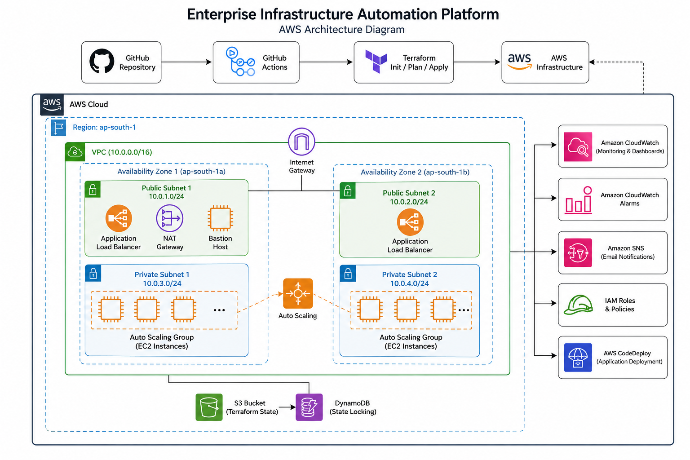
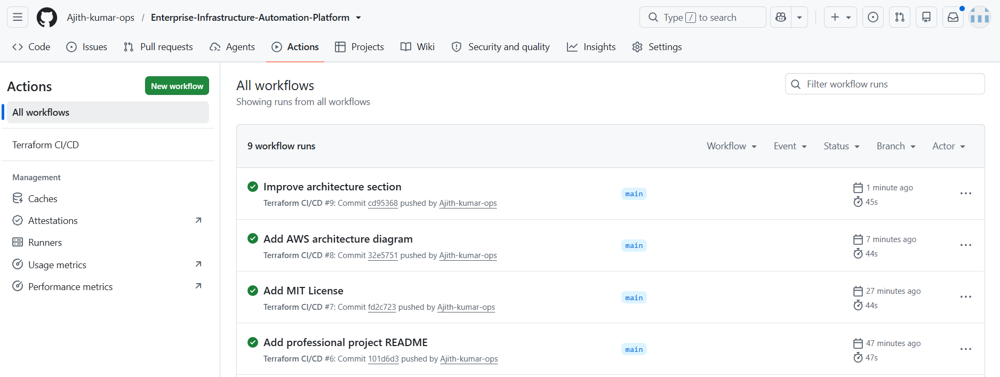
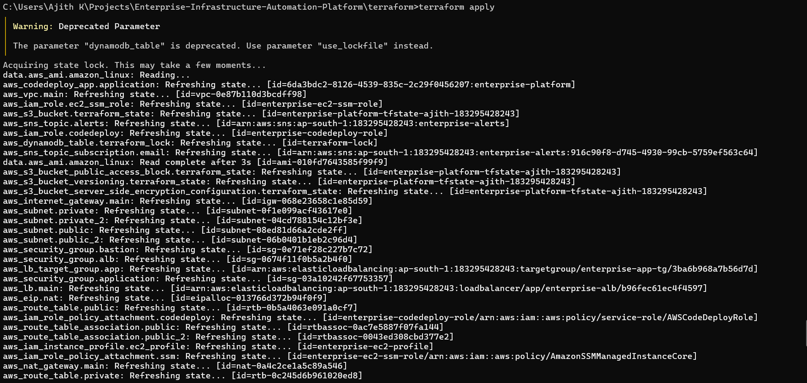
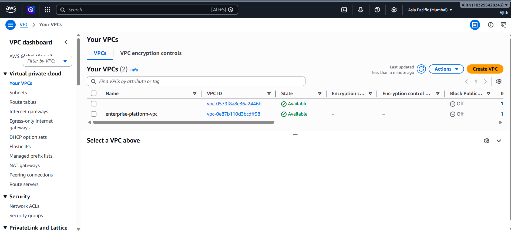
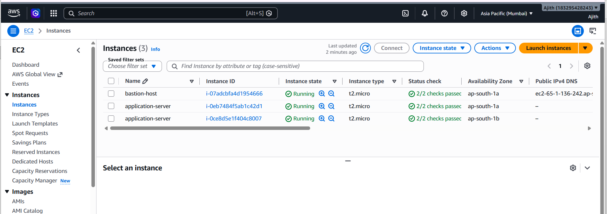
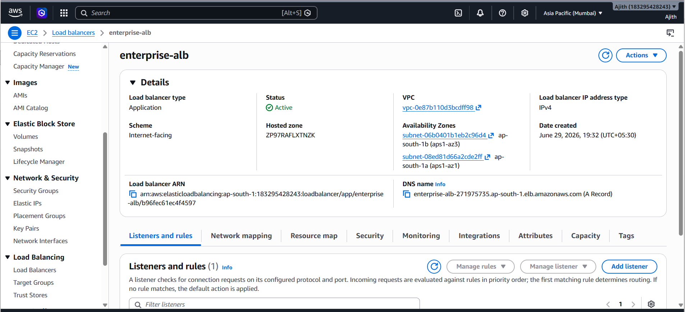
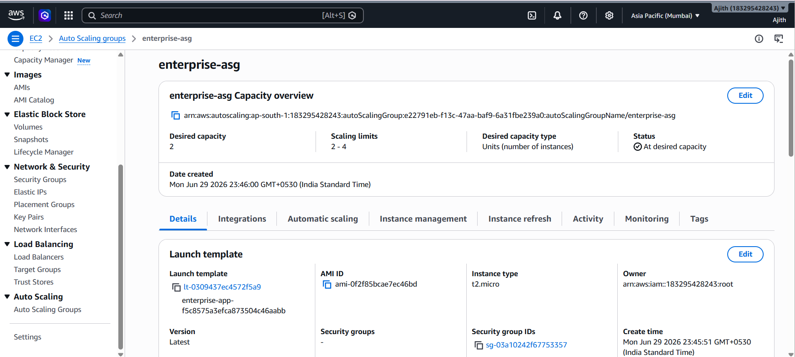

# 🚀 Enterprise Infrastructure Automation Platform


Enterprise-grade AWS Infrastructure Automation Platform built using **Terraform**, **GitHub Actions**, **AWS CodeDeploy**, **Auto Scaling**, **Application Load Balancer**, **CloudWatch**, **SNS**, **Amazon S3 Remote State**, and **DynamoDB State Locking**.

This project demonstrates how to provision, manage, and deploy a production-style AWS infrastructure using Infrastructure as Code (IaC) and CI/CD best practices.

## ✨ Features

- Infrastructure as Code (Terraform)
- Multi-AZ Virtual Private Cloud (VPC)
- Public and Private Subnets
- Internet Gateway and NAT Gateway
- Bastion Host for Secure Administration
- Application Load Balancer (ALB)
- Launch Template
- Auto Scaling Group (ASG)
- CloudWatch Monitoring and Alarms
- SNS Email Notifications
- AWS CodeDeploy Integration
- GitHub Actions CI/CD Pipeline
- Remote Terraform State using Amazon S3
- Terraform State Locking using DynamoDB
- Modular Terraform Project Structure

# 🏗️ Architecture



---

## 🏗️ Architecture


## 📸 Screenshots

### GitHub Actions CI/CD



---

### Terraform Apply



---

### AWS VPC



---

### EC2 Instances



---

### Application Load Balancer



---

### Auto Scaling Group



---

## 📁 Project Structure

```text
Enterprise-Infrastructure-Automation-Platform
│
├── .github/
│   └── workflows/
│       └── terraform.yml
│
├── diagrams/
│   └── architecture.png
│
├── screenshots/
│
├── scripts/
│   └── start.sh
│
├── terraform/
│   ├── modules/
│   │   ├── alb/
│   │   ├── autoscaling/
│   │   ├── iam/
│   │   ├── monitoring/
│   │   ├── security-groups/
│   │   ├── sns/
│   │   └── vpc/
│   │
│   ├── backend.tf
│   ├── provider.tf
│   ├── variables.tf
│   ├── outputs.tf
│   ├── versions.tf
│   ├── codedeploy.tf
│   ├── cloudwatch.tf
│   ├── autoscaling.tf
│   ├── launch-template.tf
│   └── ...
│
├── appspec.yml
├── README.md
├── LICENSE
└── .gitignore
```

## 🛠 Technologies Used

### Cloud Platform
- Amazon Web Services (AWS)

### Infrastructure as Code
- Terraform

### CI/CD
- GitHub Actions
- AWS CodeDeploy

### Networking
- Amazon VPC
- Internet Gateway
- NAT Gateway
- Route Tables

### Compute
- Amazon EC2
- Launch Templates
- Auto Scaling Groups

### Load Balancing
- Application Load Balancer (ALB)

### Monitoring
- Amazon CloudWatch
- Amazon SNS

### Storage
- Amazon S3 (Remote State)

### State Locking
- Amazon DynamoDB

### Version Control
- Git
- GitHub

## ⚙️ Prerequisites

Before deploying this project, ensure you have:

- AWS Account
- Terraform 1.12+
- AWS CLI configured
- Git
- GitHub Account

## 🚀 Getting Started

Clone the repository:

```bash
git clone https://github.com/Ajith-kumar-ops/Enterprise-Infrastructure-Automation-Platform.git
```

Navigate to the Terraform directory:

```bash
cd Enterprise-Infrastructure-Automation-Platform/terraform
```

Initialize Terraform:

```bash
terraform init
```

Validate the configuration:

```bash
terraform validate
```

Review the execution plan:

```bash
terraform plan
```

Deploy the infrastructure:

```bash
terraform apply
```

## 🔄 GitHub Actions Workflow

Every push to the `main` branch automatically performs:

1. Checkout Repository
2. Configure AWS Credentials
3. Terraform Init
4. Terraform Validate
5. Terraform Plan
6. Terraform Apply
7. Deploy Application using AWS CodeDeploy

## 🚀 Future Enhancements

- Multi-Environment Deployment (Dev, QA, Prod)
- Amazon Route 53 Integration
- AWS WAF
- SSL/TLS using AWS Certificate Manager
- Docker Container Deployment
- Amazon EKS Support
- Blue/Green Deployment Strategy
- Terraform Enterprise Integration

## 👨‍💻 Author

**Ajith Kumar**

- GitHub: https://github.com/Ajith-kumar-ops
- LinkedIn: https://www.linkedin.com/in/ajith-k-9294a0234/

## 📄 License

This project is licensed under the MIT License. See the [LICENSE](LICENSE) file for details.
